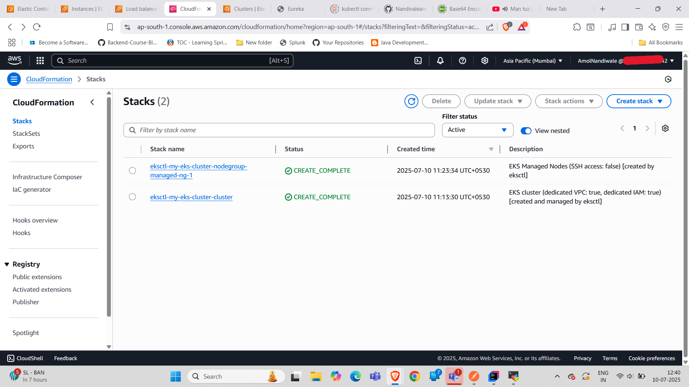
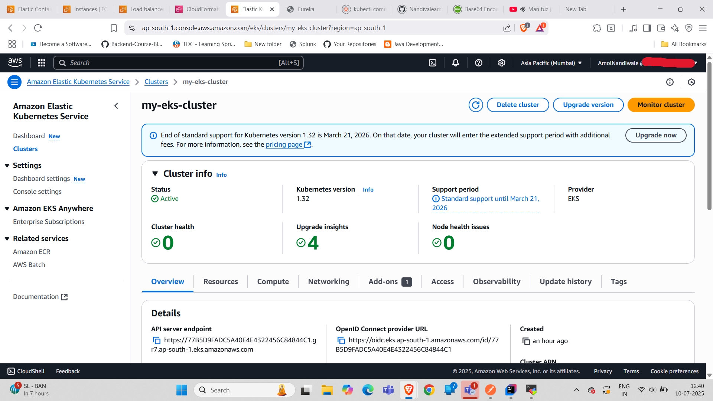
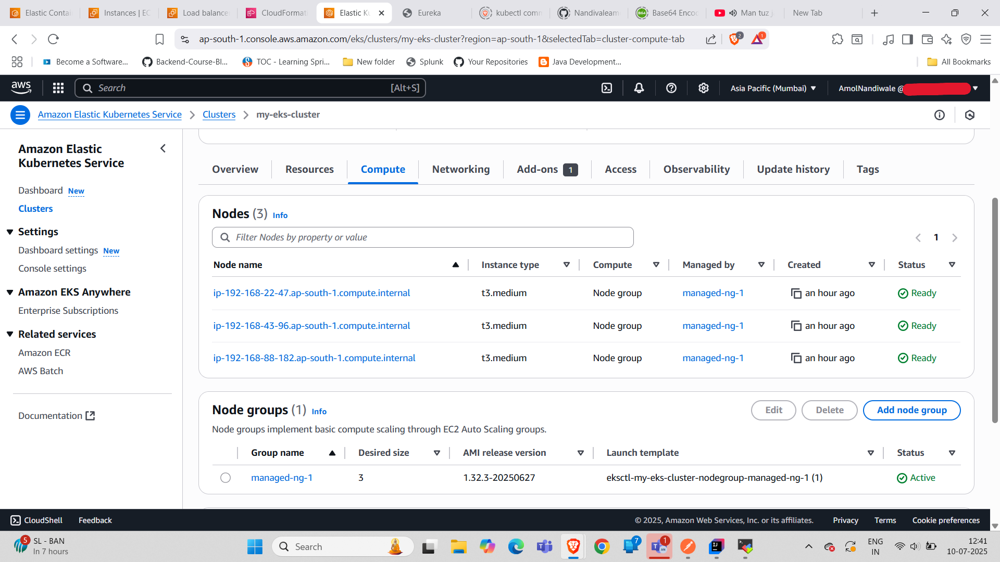
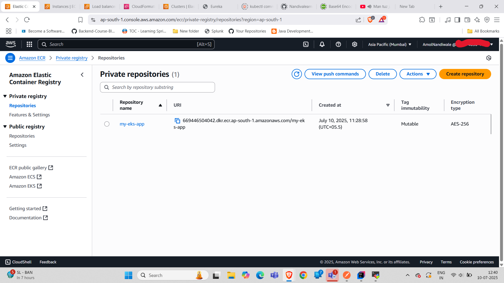
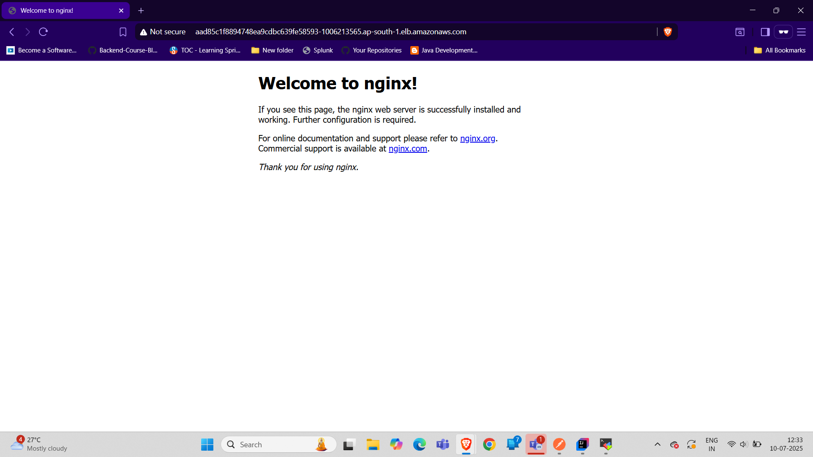

# Complete Step-by-Step Guide: EKS Cluster Setup & App Deployment

### 🔹 Prerequisites
    ✅ AWS Account with IAM admin permissions
    ✅ AWS CLI installed & configured (aws configure)
    ✅ eksctl (EKS CLI), kubectl, and Docker installed

### 🔹 Step 1: Create an EKS Cluster with Managed Node Groups
**1.1 Create `cluster-config.yaml`**

```yaml
# cluster-config.yaml
apiVersion: eksctl.io/v1alpha5
kind: ClusterConfig

metadata:
  name: my-eks-cluster          # Cluster name
  region: ap-south-1            # AWS region
  version: "1.32"               # Kubernetes version

managedNodeGroups:
  - name: managed-ng-1
    instanceType: t3.medium     # Instance type
    minSize: 2                  # Min nodes
    maxSize: 5                  # Max nodes
    desiredCapacity: 3          # Desired nodes
    volumeSize: 20              # Disk size (GB)
    labels: { role: worker }
    tags:
      environment: dev
    iam:
      withAddonPolicies:
        autoScaler: true        # Enable Cluster Autoscaler
        cloudWatch: true        # Enable CloudWatch logging
```

**1.2 Deploy the Cluster**
```bash
eksctl create cluster -f cluster-config.yaml
```
⏳ Wait 10-15 mins (Cluster + Node Groups will be created).

CloudFormation will create the necessary resources, including VPC, subnets, and security groups.

EKS Cluster Creation in AWS Console:


EKS Node Group Creation in AWS Console:



**1.3 Verify Cluster**
```bash
eksctl get cluster --name my-eks-cluster --region ap-south-1
kubectl get nodes  # Check worker nodes
```
### **🔹 Step 2: Set Up Amazon ECR (Private Docker Registry)**
**2.1 Create an ECR Repository**
```bash
aws ecr create-repository --repository-name my-eks-app --region ap-south-1
```
**2.2 Authenticate Docker with ECR**
```bash
aws ecr get-login-password --region ap-south-1 | docker login --username AWS --password-stdin <ACCOUNT_ID>.dkr.ecr.ap-south-1.amazonaws.com
```
**2.3 Build & Push a Docker Image**  
**(NOTE:- Docker engine must be installed and running on eks client machine)**
Create a simple Dockerfile for your app (e.g., NGINX):
```Dockerfile
FROM nginx:alpine
COPY . /usr/share/nginx/html
EXPOSE 80
```
Build and push the Docker image to ECR:
```bash
docker build -t my-eks-app .
docker tag my-eks-app:latest <ACCOUNT_ID>.dkr.ecr.ap-south-1.amazonaws.com/my-eks-app:latest
docker push <ACCOUNT_ID>.dkr.ecr.ap-south-1.amazonaws.com/my-eks-app:latest
```
**2.4 Verify Image in ECR**
```bash
aws ecr describe-repositories --repository-names my-eks-app --region ap-south-1
```
**ECR repositories on AWS Console**


### 🔹 Step 3: Deploy App to EKS
**3.1 Create deployment.yaml**
```yaml
# deployment.yaml
apiVersion: apps/v1
kind: Deployment
metadata:
  name: my-app
spec:
  replicas: 3
  selector:
    matchLabels:
      app: my-app
  template:
    metadata:
      labels:
        app: my-app
    spec:
      containers:
      - name: my-app
        image: <ACCOUNT_ID>.dkr.ecr.ap-south-1.amazonaws.com/my-eks-app:latest
        ports:
        - containerPort: 80
        resources:
          requests:
            cpu: "100m"
            memory: "128Mi"
          limits:
            cpu: "200m"
            memory: "256Mi"
```
**3.2 Create service.yaml (LoadBalancer)**
```yaml
# service.yaml
apiVersion: v1
kind: Service
metadata:
  name: my-app-service
spec:
  selector:
    app: my-app
  ports:
    - protocol: TCP
      port: 80
      targetPort: 80
  type: LoadBalancer
```
**3.3 Deploy to EKS**
```bash
kubectl apply -f deployment.yaml
kubectl apply -f service.yaml
```
**3.4 Verify Deployment**
```bash
kubectl get pods                  # Check running pods
kubectl get svc my-app-service    # Get LoadBalancer URL
```

**Access your app:**
Open the LoadBalancer URL in your browser to access the deployed application.
```
curl http://<LOADBALANCER-URL>:<APP_PORT>
```

### 🔹 Step 4: Clean Up (Avoid AWS Charges)
```bash
# Delete the app
kubectl delete -f deployment.yaml
kubectl delete -f service.yaml

# Delete the entire cluster
eksctl delete cluster --name my-eks-cluster --region ap-south-1
```

### 🔹 Optional Advanced Steps

🔸 Set Up HTTPS (SSL/TLS)
1. Request an ACM certificate.
2. Use Ingress Controller (NGINX/ALB) to enable HTTPS.

🔸 Auto-Scaling (HPA)
```bash
kubectl autoscale deployment my-app --cpu-percent=50 --min=2 --max=10
```
🔸 Monitoring (CloudWatch/ Prometheus)
```bash
# Enable CloudWatch Container Insights
kubectl apply -f https://raw.githubusercontent.com/aws-samples/amazon-cloudwatch-container-insights/latest/k8s-deployment-manifest-templates/deployment-mode/daemonset/container-insights-monitoring/quickstart/cwagent-fluent-bit-quickstart.yaml
```
**📌 Summary**
    
✅ EKS Cluster Created  
✅ ECR Configured for Private Docker Registry  
✅ App Deployed with LoadBalancer Access  
✅ Auto-Scaling & Monitoring Ready  