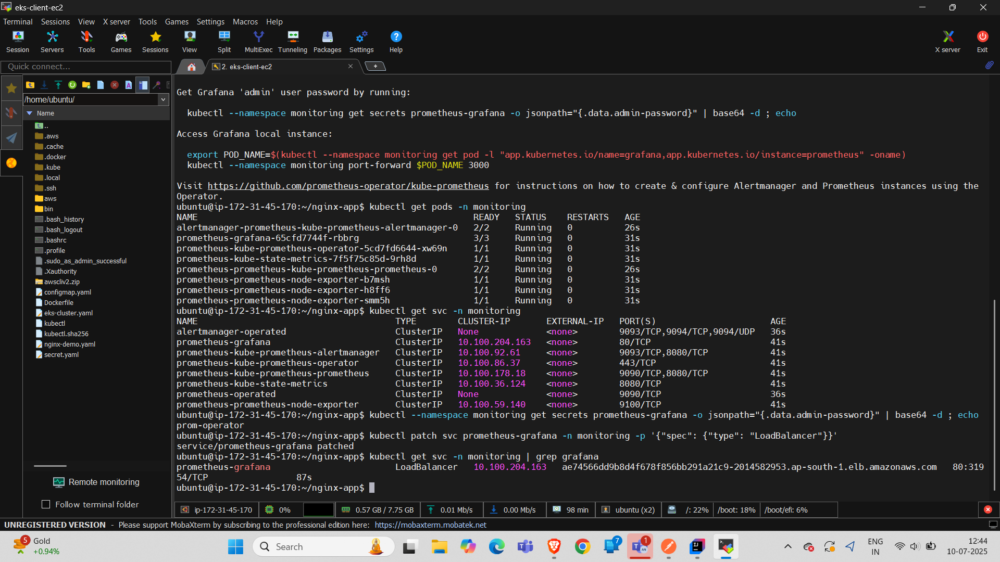
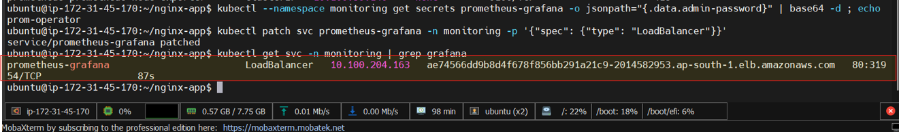
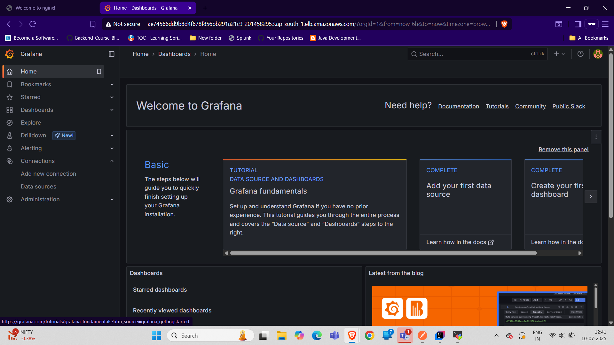
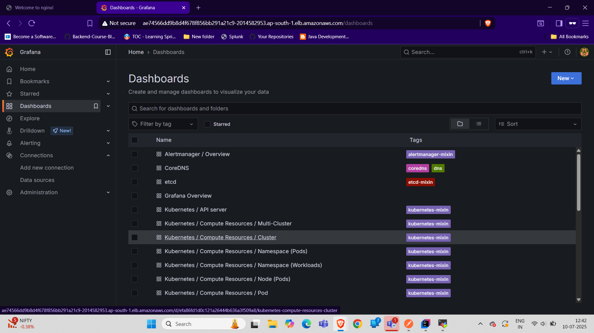
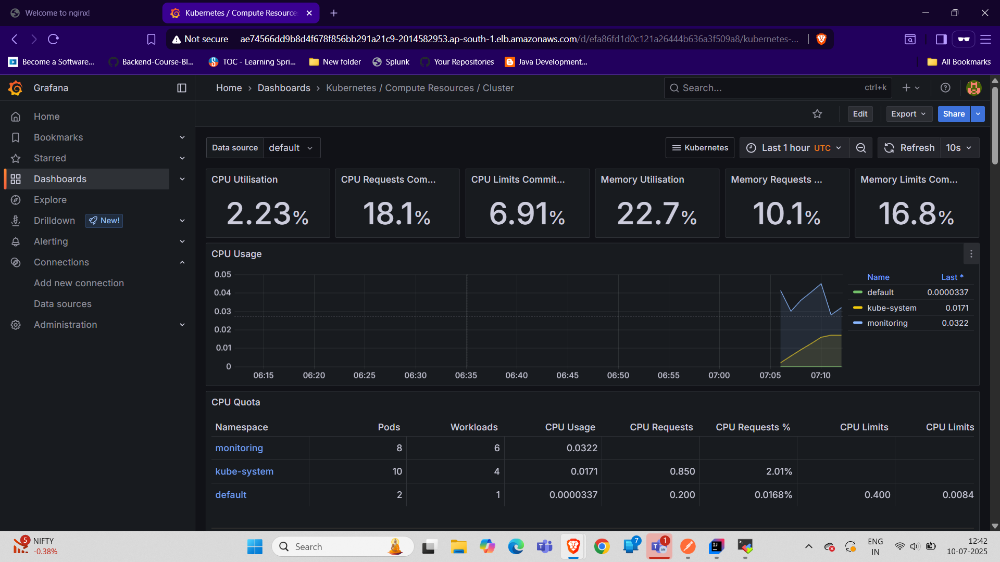
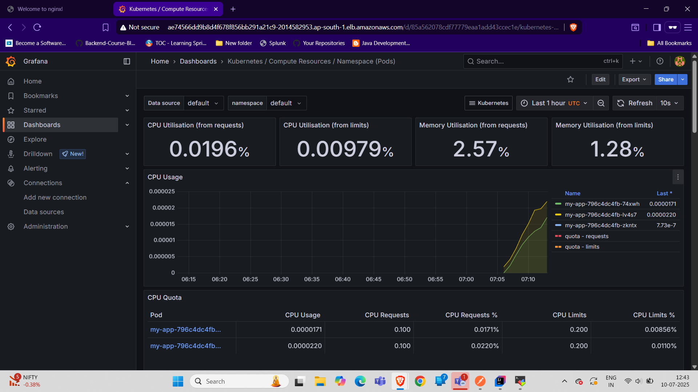

# Setting Up Prometheus + Grafana on EKS for Monitoring (Free & Open-Source)

Prometheus + Grafana is the most popular open-source monitoring stack for Kubernetes. Here's a complete step-by-step guide to set it up on your EKS cluster.

## **🔹 Prerequisites**
✅ EKS Cluster (already running)  
✅ kubectl configured (aws eks update-kubeconfig --name <cluster-name>)  
✅ Helm installed (package manager for Kubernetes)  

### **🔹 Step 1: Install Helm**
```bash
# Install Helm (Linux/macOS)
curl -fsSL -o get_helm.sh https://raw.githubusercontent.com/helm/helm/main/scripts/get-helm-3
chmod 700 get_helm.sh
./get_helm.sh

# Verify
helm version
```

### **🔹 Step 2: Install Prometheus**
**2.1 Add Prometheus Helm Repo**
```bash
helm repo add prometheus-community https://prometheus-community.github.io/helm-charts
helm repo update
```
**2.2 Install Prometheus Stack**
```bash
helm install prometheus prometheus-community/kube-prometheus-stack \
  --namespace monitoring \
  --create-namespace \
  --set prometheus.prometheusSpec.serviceMonitorSelectorNilUsesHelmValues=false \
  --set grafana.enabled=true
```
This installs:
- Prometheus (metrics collection)
- Grafana (visualization)
- Alertmanager (alerts)
- Node exporters (system metrics)

**2.3 Verify Prometheus**
```bash
kubectl get pods -n monitoring
kubectl get svc -n monitoring
```
Expected output:


### **Step 3: Access Grafana Dashboard**
**3.1 Port-Forward Grafana (Temporary Access)**
```bash
kubectl port-forward svc/prometheus-grafana -n monitoring 3000:80
```
Now open:
👉 http://localhost:3000
- Username: admin
- Password: Get it with:
    ```bash 
    kubectl get secret prometheus-grafana -n monitoring -o jsonpath='{.data.admin-password}' | base64 --decode
  ```
**3.2 (Optional) Expose Grafana via LoadBalancer**
```bash
kubectl patch svc prometheus-grafana -n monitoring -p '{"spec": {"type": "LoadBalancer"}}'
kubectl get svc -n monitoring | grep grafana
```
Wait for EXTERNAL-IP, then access:
http://<EXTERNAL-IP>:80
LoadBalancer URL Example: http://ae74566dd9b8d4f678f856bb291a21c9-2014582953.ap-south-1.elb.amazonaws.com/


### **🔹 Step 4: Import Kubernetes Dashboards in Grafana**
1. Open Grafana (http://localhost:3000 or LoadBalancer URL).
2. Import Dashboards:
   - Click "+" → Import.
     - Use these dashboard IDs (from Grafana Labs):
       - Kubernetes Cluster Summary → 315
       - Node Exporter Full → 1860 
       - Kubernetes / PODs → 6417
3. Select Prometheus as Data Source.

**Grafana UI**





### **🔹 Step 5: Configure Prometheus to Monitor EKS Apps**
**5.1 Add ServiceMonitor for Your App**
```yaml
# my-app-monitor.yaml
apiVersion: monitoring.coreos.com/v1
kind: ServiceMonitor
metadata:
  name: my-app-monitor
  namespace: monitoring
spec:
  selector:
    matchLabels:
      app: my-app  # Must match your app's service labels
  endpoints:
  - port: http  # Must match your service port name
    interval: 15s
```
Apply:
```bash
kubectl apply -f my-app-monitor.yaml
```
**5.2 Verify Prometheus Scrape Targets**

1. Port-forward Prometheus:
    ```bash
    kubectl port-forward svc/prometheus-kube-prometheus-prometheus -n monitoring 9090:9090```
   ```
2. Open: http://localhost:9090/targets
 - Check if your app appears under "serviceMonitor/monitoring/my-app-monitor/0".

### **🔹 Step 6: Set Up Alerts (Optional)**
**6.1 Example Alert Rule (CPU > 80%)**
```yaml
# high-cpu-alert.yaml
apiVersion: monitoring.coreos.com/v1
kind: PrometheusRule
metadata:
  name: high-cpu-usage
  namespace: monitoring
spec:
  groups:
  - name: cpu-alerts
    rules:
    - alert: HighCPUUsage
      expr: 100 - (avg by(instance) (rate(node_cpu_seconds_total{mode="idle"}[5m]))) * 100 > 80
      for: 5m
      labels:
        severity: warning
      annotations:
        summary: "High CPU usage on {{ $labels.instance }}"
        description: "CPU usage is {{ $value }}%"
```
Apply:
```bash
kubectl apply -f high-cpu-alert.yaml
```

### **🔹 Step 7: Clean Up (Optional)**
```bash
# Uninstall Prometheus Stack
helm uninstall prometheus -n monitoring

# Delete namespace
kubectl delete ns monitoring
```

## **🔹 Final Notes**

✅ Prometheus = Metrics collection & alerting  
✅ Grafana = Dashboards & visualization  
✅ Cost: $0 (fully open-source)  

**Next Steps**
- Persistent Storage: Configure Prometheus/Grafana to use EBS volumes.
- Long-Term Metrics: Use Thanos or Cortex for long-term storage.
- Custom Dashboards: Build Grafana dashboards for your app.
